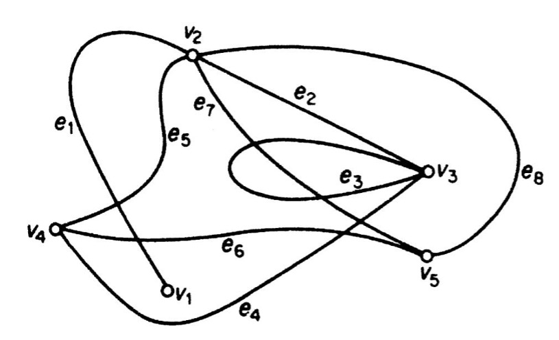

# Boruvka Algoritması

Bu algoritmayı anlatmadan önce bilmemiz gereken bazı ön bilgilerden bahsedelim.

### - Graf Teorisi (Çizgi Kuramı)
Bir topluluk ve içerisindeki bağlantı ilişkisini, çizgi (hat,kavis,kenar) ve düğümlerle (tepe) modelleyen yapıyı inceleyen Matematik dalına Graf Teorisi veya Çizgi Kuramı denir.

  

  Örnek Graf Modeli

Graflar, temsil gücü ve esneklikleri sayesinde bilgisayarlı görme çalışmalarında önemli bir araç olarak kullanılmaktadırlar. Eğer bir grafın her bir hattı ağırlık veya maliyet olarak adlandırılan bir sayı ile ilişkilendirilmişse bu graf ağırlıklandırılmış graftır.