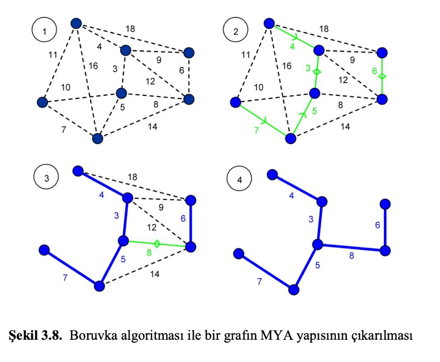

# Boruvka Algoritması

Bu algoritmayı anlatmadan önce bilmemiz gereken bazı ön bilgilerden bahsedelim.

### - Graf Teorisi (Çizgi Kuramı)
Bir topluluk ve içerisindeki bağlantı ilişkisini, çizgi (hat,kavis,kenar) ve düğümlerle (tepe) modelleyen yapıyı inceleyen Matematik dalına Graf Teorisi veya Çizgi Kuramı denir.

  

  Örnek Graf Modeli

Graflar, temsil gücü ve esneklikleri sayesinde bilgisayarlı görme çalışmalarında önemli bir araç olarak kullanılmaktadırlar. Eğer bir grafın her bir hattı ağırlık veya maliyet olarak adlandırılan bir sayı ile ilişkilendirilmişse bu graf ağırlıklandırılmış graftır.

  

  Örnek Ağırlıklandırılmış Graf Modeli

### - Görüntü Bölütleme Nedir?
Ağırlıklandırılmış graf modellerini önceden belirlenen bir kritere göre kesme işlemine Görüntü Bölütleme denir.

### - Spanning Tree (Yayılan Ağaç) Nedir?
Graflar üzerinde çalışırken veya işlem yaparken, kolaylık olması açısından grafları gösterdiğimiz ağaç modeline denir.
Spanning Tree ya da Yayılan Ağaç modelinde gösterilen bir grafın çizgileri birbiriyle döngü (cycle) oluşturmayacak şekilde, yönsüz olarak bağlanmalı ve ağırlıklandırılmış graf modeli tasarımında gösterilmelidir.

  

  Örnek Spanning Tree

### - Minimum Spanning Tree Nedir?
Bir graf bir çok yayılan ağaç modeli ile gösterilebilir. Ancak bu gösterimler arasındaki en düşük ağırlığa sahip Spanning tree gösterimine Minimum Spanning Tree denir. Aşağıdaki görselde, bir grafın bir çok farklı Spanning Tree gösteriminde ve Minimum Spanning Tree (Minimum Yayılan Ağaç) modelinde gösterildiğini görebilirisniz.

  

  Örnek Minimum Spanning Tree

Toplam ağırlığın en düşük olduğu spanning tree gösterimine Minimum Yayılan Ağaç (MYA) denir.

İşte bir grafın MYA modelinde gösterimini bulmak için literatürde kullanılan bazı algoritmalar vardır. Bunlardan en çok bilinenleri Boruvka, Prim, Kruskal ve Ters Çevir-Sil algoritmalarıdır. Bu algortimalar açgözlü (greedy) algoritmalardır. Bu nedenle bu algortimalar sonraki adımı düşünmez,her adımda bulunduğu durumdaki en iyi seçeneğe yönelir.
Bu algoritmalardan biri olan Boruvka Algoritmasını artık inceleyebiliriz.

## Borùvka Algoritması
1926 yılında Çek bilim insanı Otakar Boruvka tarafından geliştirilmiştir. Moravia Şehri için etkili bir elektrik dağıtım ağı kurulması için tasarlanan bu algoritmanın her bir adımına Boruvka adımı denir ve aşamalardan oluşur.
    "Boruvka adımı olarak adlandırılan her bir aşamada, grafındaki her bir düğüm birbirinden bağımsız alt ağaçlar ve grafı da en küçük ağırlıklı ağaçlardan oluşan bir ormanını oluşturur. Böylece, algoritma grafını bir sonraki adım için giriş verisi olarak oluşturur."
Her Boruvka adımında lineer düzeyde zaman alan bu algoritmanın zaman karmaşıklığı O(mlogn) kadardır.
Burada m çizgileri, n ise düğümleri temsil etmektedir. Bu algoritmada bütün alt ağaçlar birbirinden bağımsız hareket ettiğinden paralel işleme en uygun Minimum Spanning tree algoritması Boruvka Algoritmasıdır.

  

  Örnek Boruvka ile MYA Çıkartma

### Nasıl çalışır?
1) Her bir düğümün kendisine hattı olan düğümler arasındaki en az ağırlığa sahip hattı işaretlenir/bağlanır.
2) Kural: her bir bağlamanın cycle oluşturmaması gerekmektedir. Bir düğüm ağı takip ederek yeniden kendine ulaşamamalıdır.

Aşağıdaki gif örnek bir grafın her bir adımını sırasıyla göstermektedir.

  

  (Not: Github .gif uzantısını oynatmakta sorun çıkarabiliyor /assets/boruvka_example.gif altındaki görsele ulaşarak hareketli görüntüyü önizleyebilirsiniz.)

